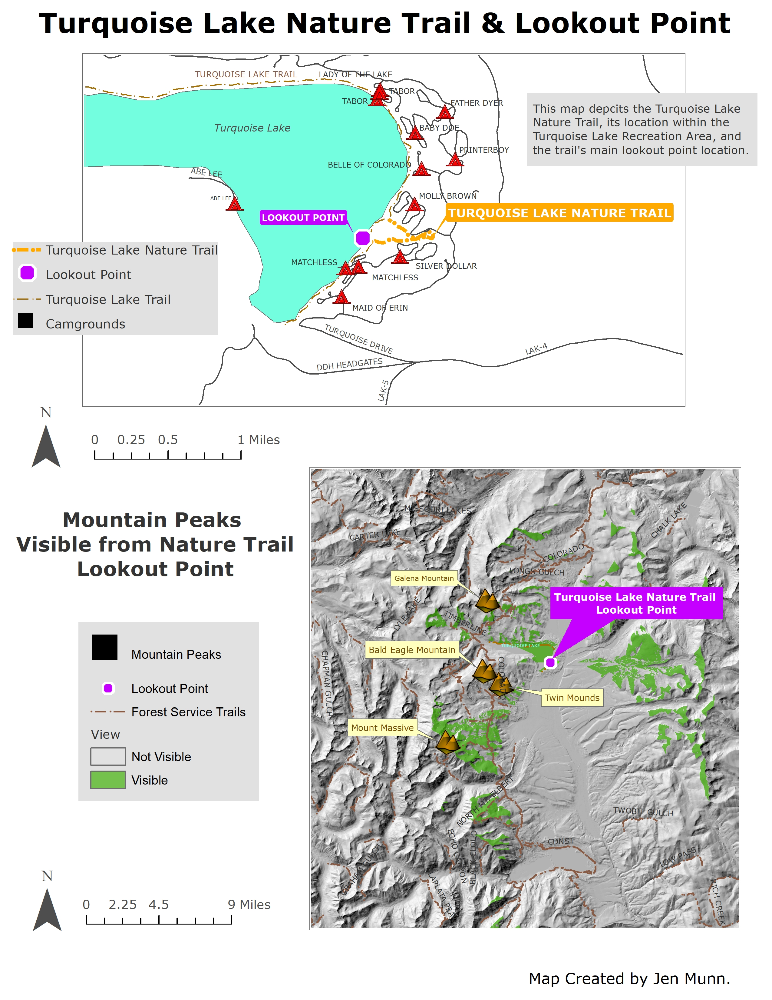
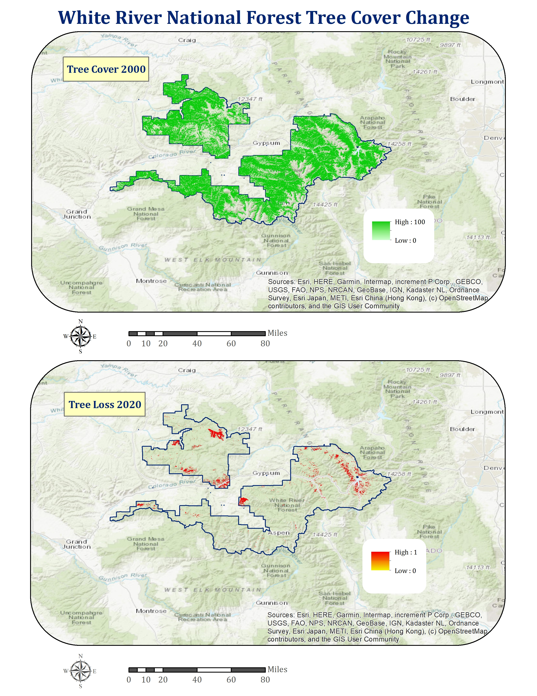
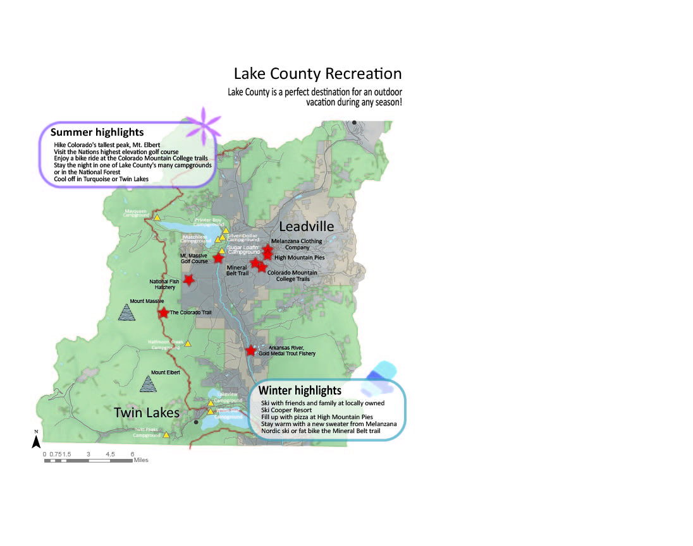
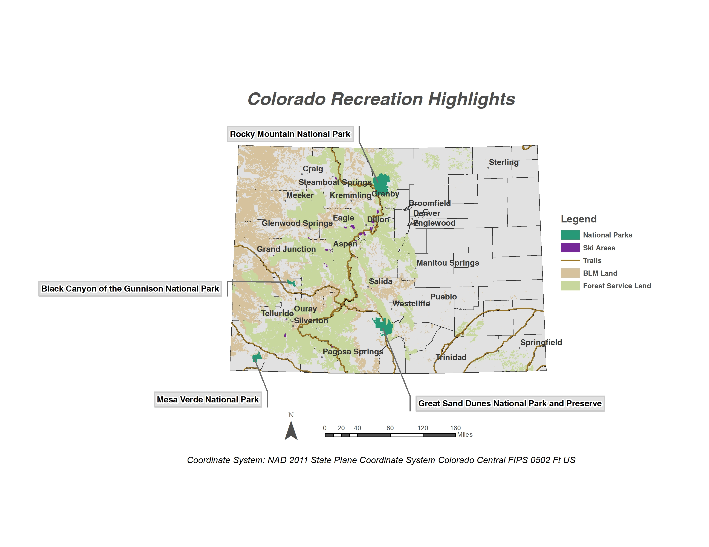
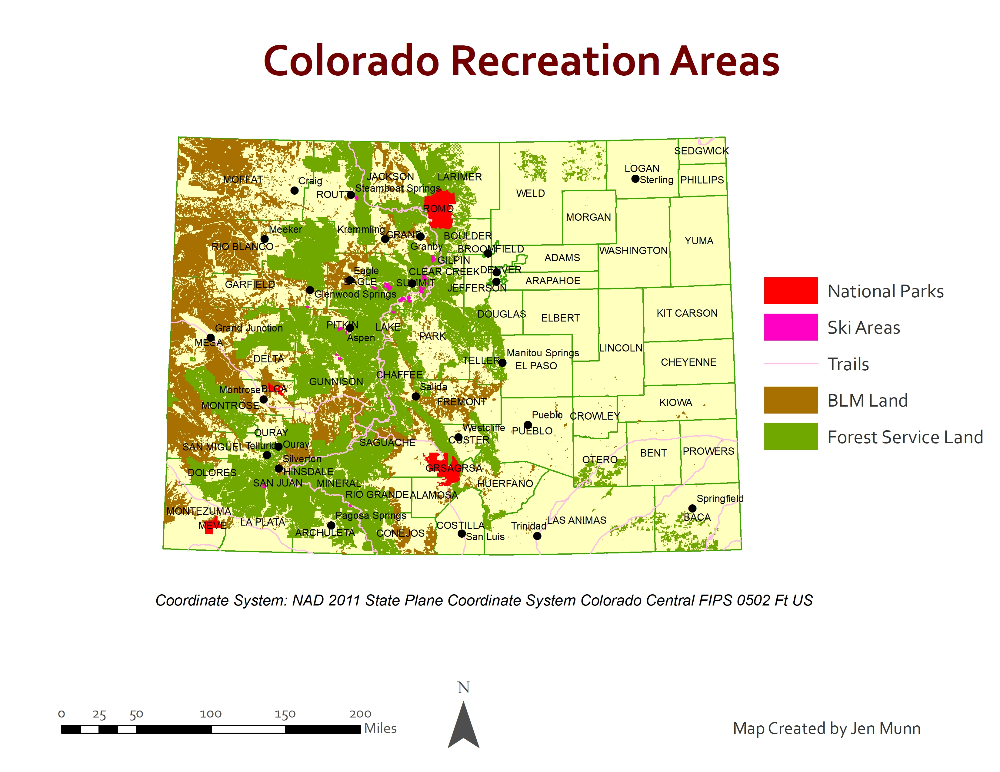
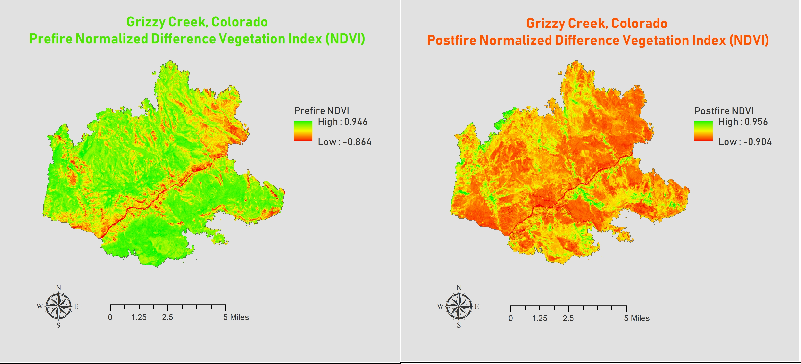

# Jen's GIS Portfolio

I have been a student in the GIS program at Colorado Mountain College for the past two years, working towards my Advanced GIS certificate.  This is a collection of my GIS projects.  I am passionate about the mapping and analysis of biological and natural resources.  My goal is to contribute to environmental stewardship utilzing my GIS skills in a long term career with the Forest Service.     
## California Park Vegetation Change
This map depicts the vegetation change within California Park in Routt National Forest, Colorado from a non-drought year and a drought year.  It shows this change in relation to the ephemeral stream network, and will be used by the Forest Service in deciding where to initiate restoration efforts using the Zeedyk method.  

## Clear Creek Beaver Restoration Potential 
This analysis shows the creek segments in Clear Creek drainage in Chaffee County, Colorado that may be conducive to restoration utilizing beaver reintroduction or beaver dam analogues.  

## California Park Beaver Restoration Assessment Tool Data
This map displays several of the main data layers in California Park, Routt National Forest, that were pre-processed for use in running the Beaver Restoration Assessment Tool (BRAT).  The BRAT will be run and, ultimately, this map will be used by the Forest Service in considering whether or not to use beaver reintroduction or beaver dam analogues for creek restoration.

## Turquoise Lake Nature Trail Viewshed 
These map show the location of the Turquoise Lake Nature Trail near Leadville, Colorado, the main lookout point along the trail and the mountain peaks in view from the lookout.  

## White River National Forest Tree Cover 
This map analysis shows the change in tree cover that occured in White River National Forest from 2000 to 2020.  

## Lake County, Colorado Recreation 
This map shows the recreation highlights in Lake County, Colorado.  

## Colorado Recreation Highlights
This map shows the recreation highlights in the state of Colorado.  

## Colorado Recreation Areas
This map shows the main recreation areas in the state of Colorado.  
 
## Grizzly Creek Pre and Post Fire NDVI
This map analysis utilizes the Normalized Difference Vegetation Index to show vegetation changes post fire in the Grizzly Creek area of Colorado.  

## Grizzly Creek Land Cover Classifications 
This map analysis shows the difference between the National Land Cover Database Classification and an Unsupervised Land Cover Classification effort, in the Grizzly Creek area of Colorado.  

## Steamboat Springs Supervised Vegetation Classification
This map analysis shows a Supervised Vegetation Classification of Steamboat Springs, Colorado. The data frames include the Maximum Likelihood Classification and Output Confidence.  

## Spatial Autocorrelation
This map is an analysis of library patrons utilizing Spatial Autocorrelation.  

