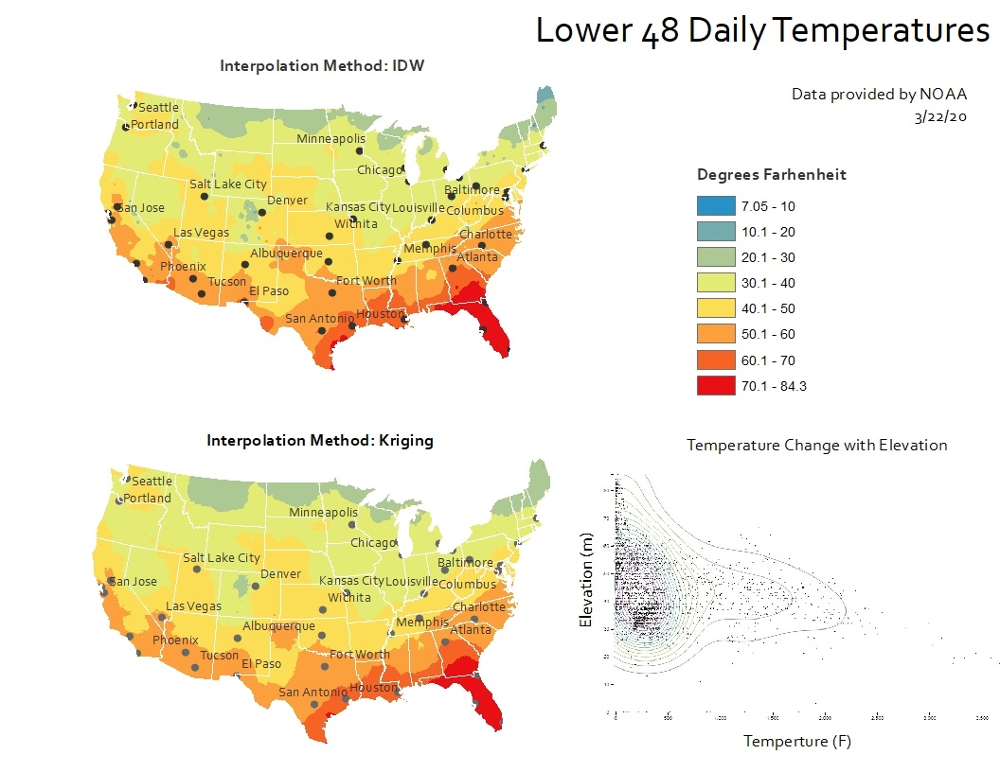
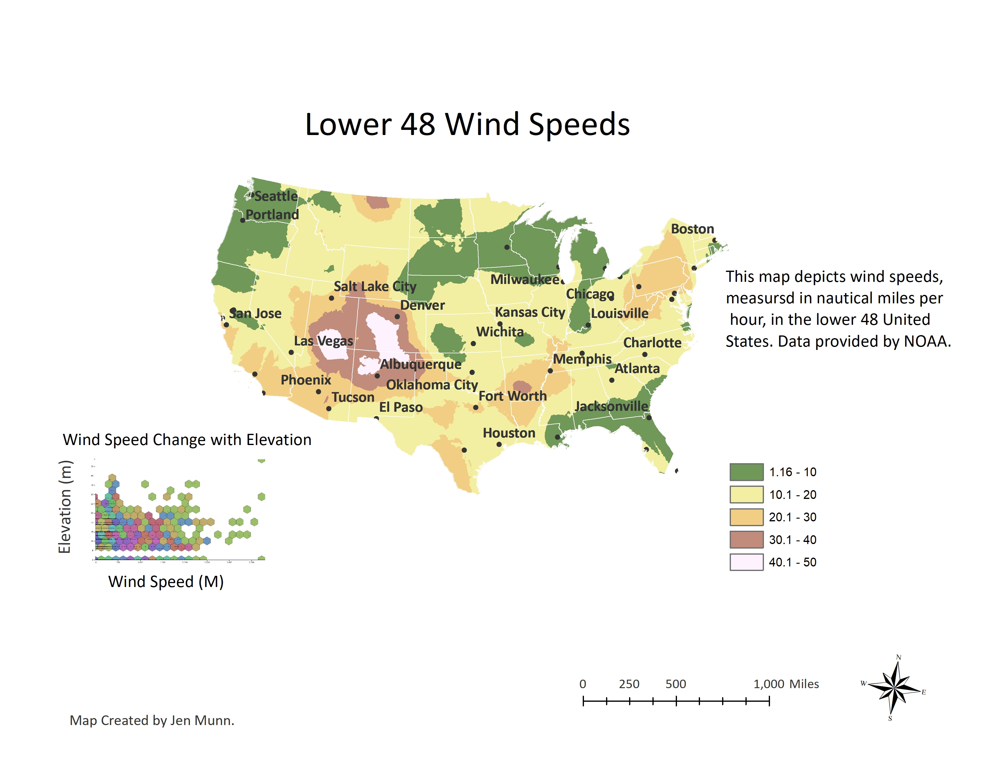

# Jen's GIS Portfolio

I have been a student in the GIS program at Colorado Mountain College for the past two years, working towards my Advanced GIS certificate.  This is a collection of my GIS projects.  I am passionate about the mapping and analysis of biological and natural resources.  My goal is to contribute to environmental stewardship utilzing my GIS skills in a long term career with the Forest Service.     

## Bald Eagle Story Map
The following is a story map that presents the narrative of the bald eagle's comeback in the state of Colorado.  This story map is available to the public and serves as an inspirational example of the importance of environmental stewardship and resource management.  
[BaldEagle](https://arcg.is/1OrKaO0)

## California Park Vegetation Change
Utilzing NDVI remote sensing data, this map depicts the vegetation change within California Park in Routt National Forest, Colorado.  It shows the change in vegetation in relation to the ephemeral stream network from a non-drought year to a drought year.  This is the initial analysis completed as part of an ongoing research project for the Routt National Forest and will be ultimately used by the Forest Service team in deciding where to initiate restoration efforts using the Zeedyk method.

## California Park Beaver Restoration Assessment Tool Data
This map displays several of the critical data layers that were pre-processed using advanced methods for use in running the Beaver Restoration Assessment Tool (BRAT) for California Park in Routt National Forest.  The BRAT will be run and, ultimately, this map will be used by the Forest Service team in considering whether or not to use beaver reintroduction or beaver dam analogues for creek restoration in the vital ecosystem of California Park.  

## Clear Creek Beaver Restoration Potential 
This map analysis shows the creek segments within Clear Creek drainage in Chaffee County, Colorado that may be conducive to restoration utilizing beaver reintroduction or beaver dam analogues.  It will be used to present possible ecosystem management options to the Pike San Isabel Forest Service team.  

## Turquoise Lake Nature Trail Viewshed 
These map show the location of the Turquoise Lake Nature Trail near Leadville, Colorado, the main lookout point along the trail and the mountain peaks in view from the lookout.  

## White River National Forest Tree Cover 
This map analysis shows the change in tree cover that occured in White River National Forest from 2000 to 2020.  

## Lake County, Colorado Recreation 
This map shows the recreation highlights in Lake County, Colorado.  

## Colorado Recreation Highlights
This map shows the recreation highlights in the state of Colorado.  

## Colorado Recreation Areas
This map shows the main recreation areas in the state of Colorado.  
 
## Bald Eagle Stormy Map 
The following story map tells the story of the Bald Eagle's comeback in the state of Colorado.  
[BaldEagle](

## Grizzly Creek Pre and Post Fire NDVI
This map analysis utilizes the Normalized Difference Vegetation Index to show vegetation changes post fire in the Grizzly Creek area of Colorado.  

## Grizzly Creek Land Cover Classifications 
This map analysis shows the difference between the National Land Cover Database Classification and an Unsupervised Land Cover Classification effort, in the Grizzly Creek area of Colorado.  

## Steamboat Springs Supervised Vegetation Classification
This map analysis shows a Supervised Vegetation Classification of Steamboat Springs, Colorado. The data frames include the Maximum Likelihood Classification and Output Confidence.  

## Denver Population Density
This map represents the Denver metro area's population density by County. 

## Spatial Autocorrelation
This map is an analysis of library patrons utilizing Spatial Autocorrelation.  

## Lower 48 Daily Temperatures by Interpolation
These maps demonstrate the use of Interpolation methods to display the daily temperatures of the lower 48 of the U.S.  

## Lower 48 Wind Speeds
This map depicts wind speeds of the Lower 48.  

## Democratic Voting Percentage 
This map depicts the percentage of the population by county within the Lower 48 that voted Democratic in 2016, using Natural Breaks classification.  

